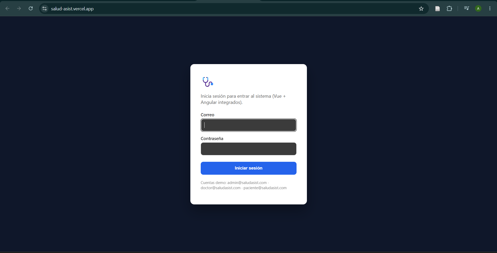
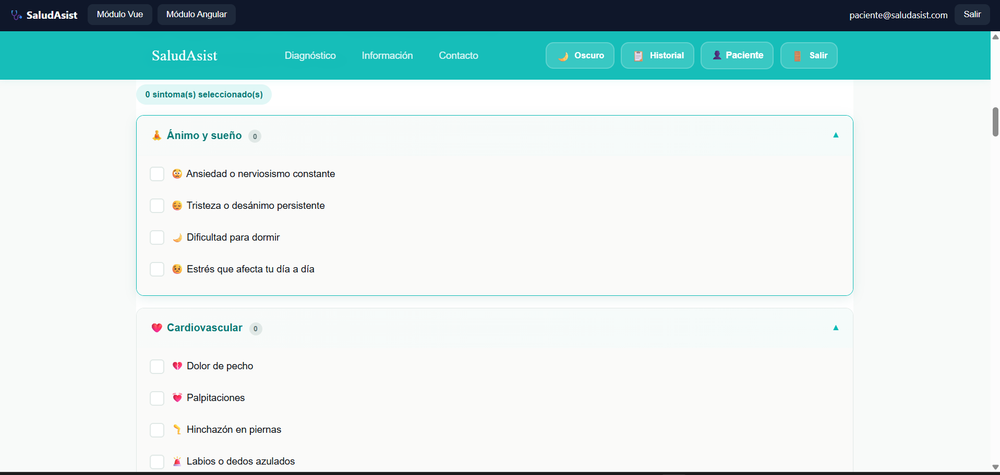
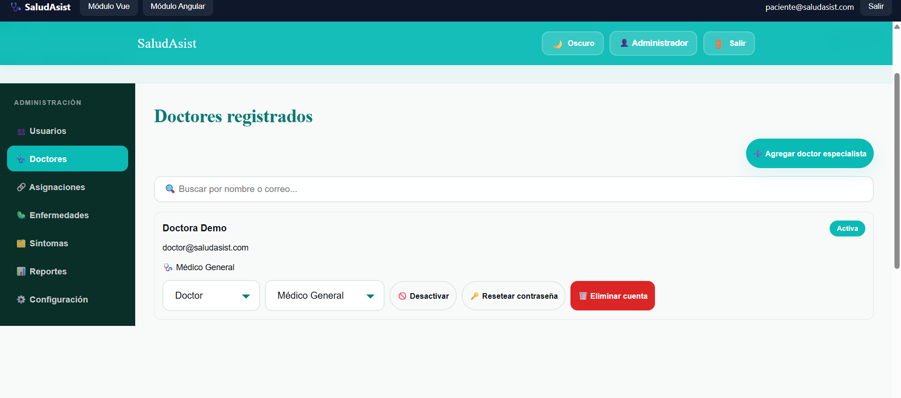

# 🩺 SaludAsist — Proyecto integrado (Hito Final / Demo Day)

**Grupo H — IS-403 Aplicaciones para el Cliente Web** · Adrian Omar Burgos Macias (Vue) · Alex Javier Alvarado Saltos (Angular)

Sistema de pre-diagnóstico médico con IA basado en reglas. El paciente marca sus síntomas, recibe hasta 3 posibles diagnósticos con gravedad y derivación sugerida, y un doctor especialista revisa esas evaluaciones y deja una nota clínica.

> ⚠️ **Aviso importante:** SaludAsist es una herramienta educativa. **No reemplaza una consulta médica profesional.** En una emergencia, llama al 911 o al servicio de emergencias de tu país.

---

## 🔗 Producción

- **App integrada:** https://salud-asist.vercel.app/
- **Repositorio:** este mismo repo (monorepo del equipo)

## 🧩 Quién construyó qué módulo

| Módulo | Integrante | Responsabilidad dentro del flujo |
|---|---|---|
| **Contenedora** (`/contenedora`, vanilla-ts) | Equipo | Login real contra Supabase + menú que carga cada módulo en un iframe |
| **Vue** (`/vue`) | Adrian Omar Burgos Macias | Paciente: evalúa síntomas, ve su historial · Administrador: usuarios, asignaciones, catálogo |
| **Angular** (`/angular`) | Alex Javier Alvarado Saltos | Doctor: revisa a sus pacientes asignados, lee las evaluaciones que escribió el módulo Vue, deja nota clínica, cambia su disponibilidad |

Los tres viven bajo el **mismo origen** en el deploy final y comparten sesión a través de Supabase Auth (ver sección de arquitectura).

## 📁 Estructura del repositorio

Un módulo por carpeta, cada uno con su propio `package.json`; la raíz solo orquesta el build integrado.

```
/
├── contenedora/    ← vanilla-ts: login + menú (iframe)
├── vue/            ← paciente + administrador (Adrian)
├── angular/        ← panel de doctor (Alex)
├── supabase/       ← schema.sql (tablas + RLS + semilla)
├── scripts/        ← build-integrado.mjs (arma dist-integrado/)
├── docs/capturas/  ← screenshots para este README
├── package.json    ← solo el script build:integrado
└── vercel.json
```

## 🏗️ Arquitectura del deploy integrado

```
dist-integrado/
├── index.html          ← contenedora (login + menú)
├── vue/                ← build del módulo Vue (paciente + admin)
└── angular/             ← build del módulo Angular (doctor)
```

- **Un solo Supabase compartido** por todo el equipo (`supabase/schema.sql`): tablas `perfiles`, `categorias`, `sintomas`, `reglas_diagnostico`, `asignaciones`, `evaluaciones`, todas con **RLS activado** y políticas declaradas (quién puede leer/escribir cada una).
- **Un solo login**: la contenedora autentica contra Supabase Auth (`supabase.auth.signInWithPassword`). Los módulos Vue y Angular, al vivir bajo el mismo origen, **heredan automáticamente esa misma sesión** porque `@supabase/supabase-js` la persiste en `localStorage` bajo una clave por proyecto (`sb-<ref>-auth-token`) — no hace falta pasarse tokens a mano entre módulos.
- **Hash routing en los 3 módulos** (`/vue/#/paciente`, rutas de Angular con `withHashLocation()`): el servidor estático nunca ve la ruta interna, así que no hace falta configurar redirects.
- **Prueba real de integración**: el paciente (Vue) guarda una evaluación en la tabla `evaluaciones`; el doctor (Angular) la lee — RLS permite esa lectura solo si el paciente está asignado a ese doctor (tabla `asignaciones`).

## 🚀 Cómo ejecutarlo localmente

Requiere Node 18+ y una cuenta de Supabase (gratuita).

### 1. Backend (una sola vez por equipo)
```bash
# En el dashboard de Supabase: SQL Editor → pegar y correr supabase/schema.sql
# Authentication → Providers → Email → desactivar "Confirm email" (no hay servidor de correo real)
```

### 2. Cada módulo por separado (desarrollo)
```bash
# Módulo Vue
cd vue && npm install
cp .env.example .env.local   # completar VITE_SUPABASE_URL y VITE_SUPABASE_ANON_KEY
npm run dev                   # http://localhost:5173

# Contenedora
cd contenedora && npm install
cp .env.example .env.local
npm run dev                   # http://localhost:5175 (o el puerto libre)

# Módulo Angular
cd angular && npm install
npm start                     # http://localhost:4200
```
En desarrollo cada uno corre en un puerto distinto (orígenes distintos), así que **no comparten sesión entre sí** todavía — eso solo pasa en el build integrado, donde los tres viven bajo el mismo origen.

### 3. Build integrado (lo que se despliega)
```bash
npm run build:integrado   # construye los 3 proyectos y arma dist-integrado/
npx vite preview --outDir dist-integrado --port 4600   # probarlo localmente
```

## 🔑 Cuentas de prueba

| Rol | Correo | Contraseña |
|---|---|---|
| 🛡️ Administrador | `admin@saludasist.com` | `Admin123!` |
| 🧑‍⚕️ Doctor | `doctor@saludasist.com` | `Doctor123!` |
| 🩹 Paciente | `paciente@saludasist.com` | `Paciente123!` |

## 🌐 Despliegue (Netlify / Vercel)

- **Vercel**: ya incluye `vercel.json` con `buildCommand: npm run build:integrado` y `outputDirectory: dist-integrado`. Solo hay que configurar las variables de entorno `VITE_SUPABASE_URL` y `VITE_SUPABASE_ANON_KEY` en el proyecto de Vercel.
- **Netlify**: build command `npm run build:integrado`, publish directory `dist-integrado`, mismas variables de entorno.

## 📸 Capturas

| Login (contenedora) | Evaluación de síntomas (Vue) | Panel de administración (Vue) |
|---|---|---|
|  |  |  |

## 📌 Limitaciones conocidas (honestas)

- **Resetear contraseña de otra cuenta** y **crear cuentas sin pasar por signUp** requieren la Admin API de Supabase (`service_role` key), que a propósito no se expone en el cliente — el panel de admin lo señala en vez de fingir que funciona.
- **Borrar un usuario** solo borra su fila en `perfiles` (no la cuenta de `auth.users`, que requiere esa misma Admin API) — simplificación aceptada para este demo.
- El catálogo de enfermedades cubre motivos de consulta frecuentes, no es una lista exhaustiva.
- No hay suite de tests todavía contra el nuevo backend (los tests viejos probaban localStorage y se eliminaron al migrar — ver abajo).

## 📝 Decisiones y aprendizajes

**Cómo dividimos los módulos:** el dominio (evaluación de síntomas, historial, catálogo, usuarios) ya existía completo en Vue de un hito anterior. En vez de partirlo a la mitad de forma artificial, dejamos ese dominio completo en Vue (paciente + administración) y construimos el panel de doctor **desde cero en Angular** como una superficie nueva y acotada que lee/escribe las mismas tablas de Supabase — así cada módulo tiene una responsabilidad clara dentro del mismo flujo, en vez de dos copias parciales de lo mismo.

**El problema técnico más difícil:** migrar toda la capa de datos de un modelo síncrono basado en `localStorage` a Supabase asíncrono sin romper media docena de componentes que asumían que `listarUsuarios()`, `cargarHistorial()`, etc. devolvían el dato al instante. La parte más delicada fue **RLS**: diseñar políticas donde el doctor solo ve evaluaciones de sus pacientes asignados (vía un `exists` contra la tabla `asignaciones`) sin caer en recursión infinita al consultar `perfiles` desde su propia política — se resolvió con una función `security definer` (`rol_actual()`) que rompe ese ciclo.

**Qué haríamos distinto:** empezar con Supabase desde la semana 1 en vez de construir todo el dominio contra `localStorage` primero y migrarlo después — la migración fue la parte más cara del proyecto. También escribiríamos los tests nuevos (mockeando el cliente de Supabase) antes de la entrega, no después.
